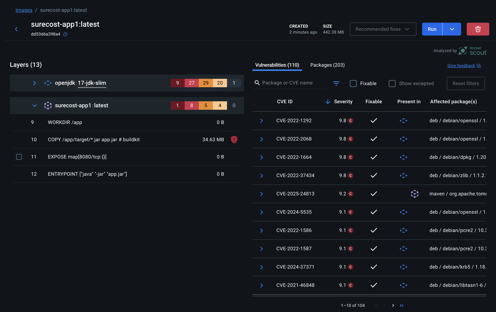

# Overview of Approach and Development

# Design Approach
For this exercise I wanted to test the limits of Cursor, while keeping in check its limitations (if they exist). With my prior experience with using GPT4/3.5 I knew that building/startup issues would be the biggest shortcoming for relying on the tools. Therefore, I focused on using Cursor to setup a cookie cutter project by specifying tool to use.
### Initial Query to Cursor
`setup a springboot java project for api development with docker, docker-compose, a dockerized nosql db with configuration and connection setup within the springboot java application. This should be setup with an NGINX load balancer and 3 application containers`

Instead of asking for any backend logic to be implemented, I kept things very high level, specifying the technologies to use, the architecture that I envision, and the server configurations.

I also had Cursor implement unit tests, sonar coverage, and configurable running with/without testing
```
add sonar for code coverage, complexity, and vulnerability analysis

add an 80% minimum coverage requirement

fully cover the code with unit tests

modify run.sh to have a flag to enable/disable running unit tests when launching the application
```
 
Following this, my interactions were mainly for debugging issues arising from running locally.

# Issues Encountered
### Cursor/AI Related
#### Building/Running
##### 1. Building/Running was tedious
Docker setup/configuration was by far the biggest shortcoming with using Cursor. This was expected based on my past experience:
* It took multiple iterations of prompting and self debugging to get the application to build and run. Worse still, when reopening the same untouched and previously working codebase, Docker issues again plagued.
* At one point, the original docker base image 
##### 2. Cursor did not properly handle my second logic query
```
- Rename "Item" and all its references to "PharmacyItem" 
- update the controller with my new PharmacyItem model. Also add the following functionalities:
- create multiple items in one call (accept a list or singular item)
- delete items based on manufacturer and/or UID and/or name and/or price (less than, greater than, equal to, and between)
- update items (allow updating individual attributes without needing to provide the full object)
- query items based on Name, manufacturer, price (less than, equal to, between, greater than)
```
However, this did not modify as I expected:
* My manual updates of Item (changing id to UID and its type from String to UUID) were overwritten despite telling the model to use "my new PharmacyItem model"
* Although objects were renamed properly, the filenames still referred to "Item" instead of "PharmacyItem"
* There was no composite keying of Manufacturer, name, and price
##### 3. Cursor does not keep track of previous context/prompts well
* On numerous occasions, prompting after a while requires answering more questions; for example, previously provided mvn commands are re-created by looking at the pom.xml rather than just using the previous answer itself.

#### Vulnerabilities
* Docker desktop pointed out numerous CVE vulnerabilities in both Maven and the base image that Cursor Used. These include Critical and High severity


#### Error Handling
* Proper error responses/codes were not implemented in all cases. For example, in the Create Item method and Search methods, failures (including no item found in search) would cascade an error stack trace to the caller.

#### Logic Issues
* Queryies such as min/max were done oddly. Whereas one would imagine it to be inclusive and max and min price, Cursor assumed range exclusive
* The controller became highly complicated and difficult to read due to the mechanisms that Cursor used for Swagger support. This can be a roadblock for extensibility. 

# Final Thoughts
* Using Cursor etc. is effective for GreenField development. This is especially the case for rapid prototyping. To ensure platform independent issues, dockerizing any application is highly recommended. That way, the AI tool will have a full understanding of dependencies etc, since these will be consistent for a docker image, with the tool specificying any non-default installations.
* As I had feared, a significant flaw in AI derived/vibe coding is the security aspect. Despite CVE's being readily accessible, Cursor seemingly did not evaluate these for Maven nor the base image. Therefore, blindly using these tools in production is a very bad idea.
* On the code side, although my prompt was very rudimentary, I was happy that Cursor did not bloat the application with many unneeded dependencies or methods. I'm curious to see how this handles complex prompts.
* Even though I only mentioned that I wanted a SpringBoot application connected to a NoSQL db, Cursor did exactly what I was envisioning: Rest Controllers and MongoDB. By doing this, I simply needed to modify the Model and Controller to address the actual problem requirements.
* Inline/tab complete is pretty good. I created a "init_environment.sh" script and Cursor accurately predicted everything I wanted done.
* Care is needed when prompting for updates to any file. Cursor tends to be very heavy handed with updates/changes and won't incrementally scale back on things when asked vaguely